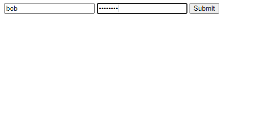
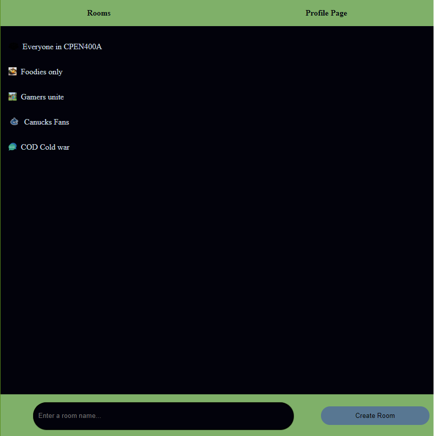
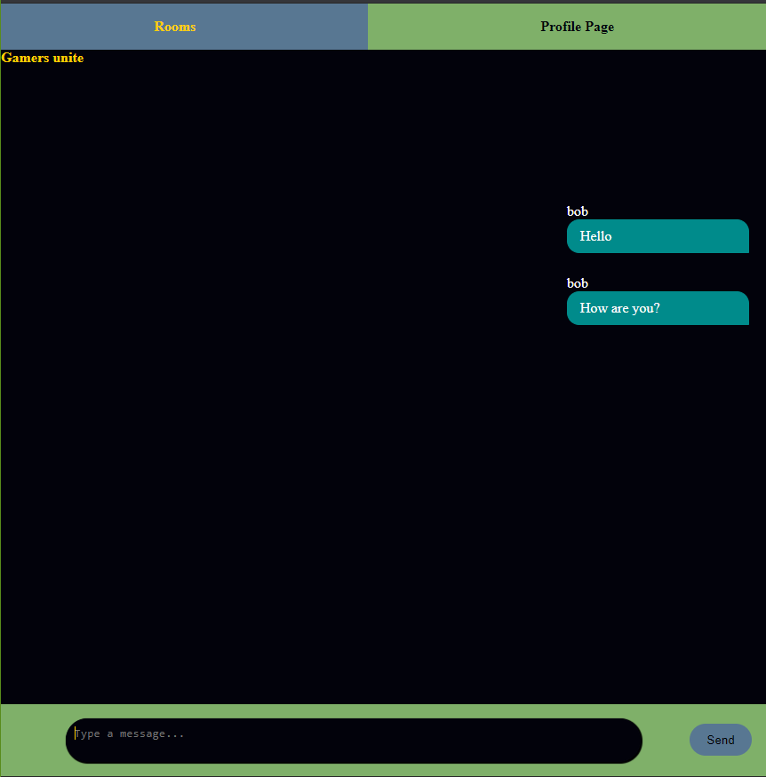
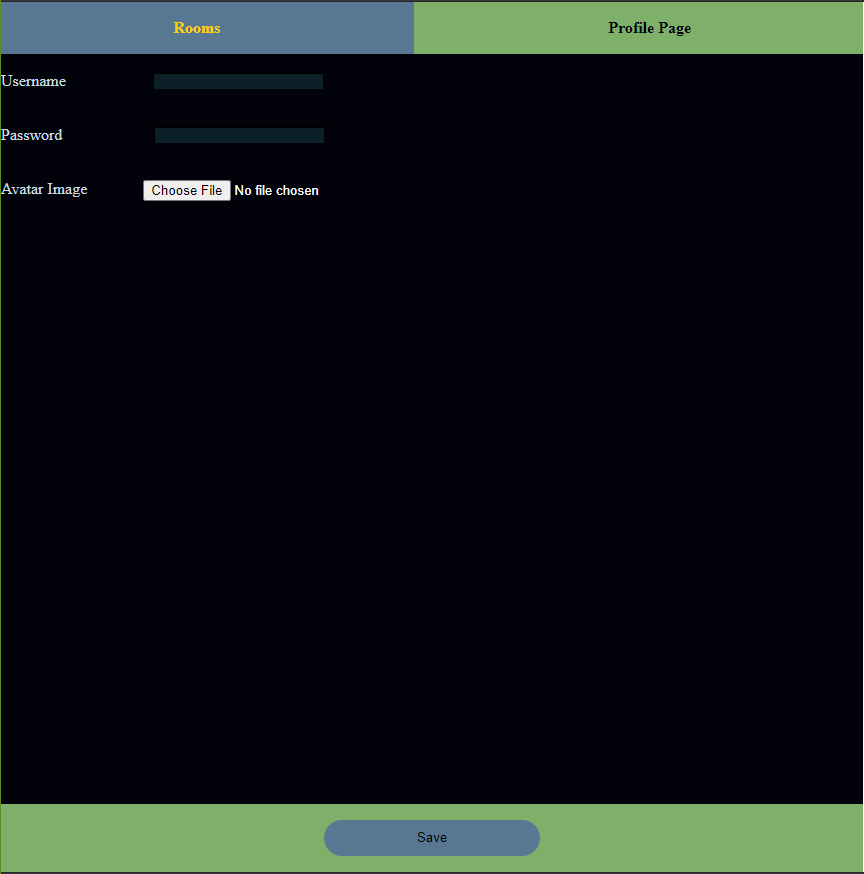

# Chatroom #
 **A chatroom built using HTML, CSS, JavaScript, MongoDB, and ExpressJS**
 
 ## Main Parts of the Web Application ##
 **1) Client-side GUI using HTML and CSS**
 
 **2) Dynamically Rendered Client-Side**
   * Turns the application into a Single-page Application by dynamically replacing the DOM depending on the URL in the address bar ("Client-side routing")
   * Uses event handlers to add interactivity in the application and to update the application state.
 
 **3) Exchanging Data with the Server**
   * Implements the client-side functionalities to read and update the list of chat rooms from the server via AJAX requests.
   * Implement a WebSocket client to send and receive messages from the WebSocket server.
   * Implement a WebSocket server to act as a message broker between the client applications.
 
 **4) Data Persistence using MongoDB**
   * Set up a MongoDB database for the application
   * Write a "driver" for interacting with the MongoDB service.
   * Create REST endpoints for reading objects from the database.
   
 **5) Adding Authentication and Securing the Application**
   * Implement a simple authentication mechanism.
   * Protect server resources from unauthorized users by using session cookies.
   * Sanitize user input to defend against Cross-Site Scripting attacks.

## Simple login page ##

## Main page ##

## Room Page ##

## Profile Page ##

